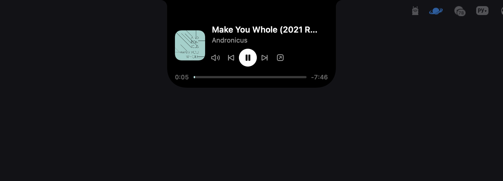
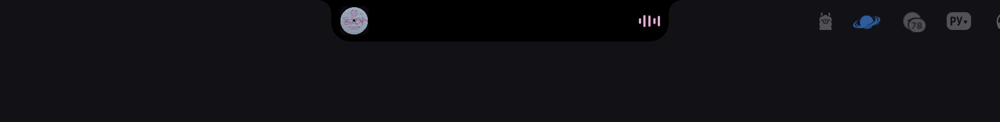
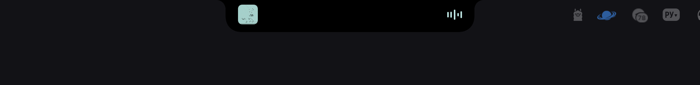
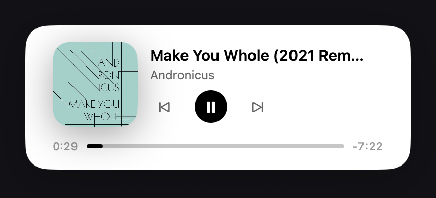
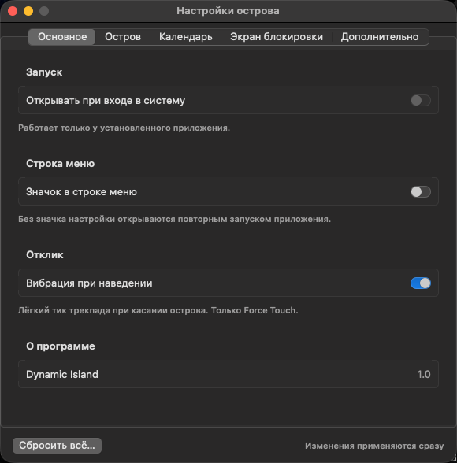

# Dynamic Island for Mac

An iOS-style Dynamic Island for your Mac's notch — Now Playing, calls, timers, calendar, and a live-activity API for your own scripts.



All screenshots below are live captures of the app running on this Mac (real Spotify track, real
lock-screen overlay, real Settings window) — not mockups.

## Status

**Ready to use.** Build it from source and run it — the app is stable in day-to-day use, with a real (if informal) QA process behind it: 177 unit tests plus a debug MCP harness that drives the live UI and checks invariants after every action (see `claude.md`).

Known limitations, honestly:
- No Developer ID signing — the app is ad-hoc signed at build time, so a downloaded copy (not built locally) would trigger Gatekeeper. Building from source avoids this.
- The lock-screen overlay relies on the private, undocumented `SkyLightSpace` API and could break on a macOS update.
- "Like" only works for Apple Music — Spotify doesn't expose a scriptable like without OAuth.
- The system Clock timer is read-only (from `mobiletimerd`'s log) — you can't pause/cancel it from the island, only from the Clock app.
- Calls are detected by which process holds the microphone/camera, so a browser tab using the mic for something other than a call (e.g. dictation on a website) can register as a call.

## Features

**Now Playing for any source** — Spotify, Apple Music, and any browser tab playing audio/video (YouTube, SoundCloud, Twitch, etc. in Chrome, Safari, Arc, Firefox, Yandex Browser), plus any other media app. Pages without a cover fall back to the browser/app icon; live streams show "LIVE".

Collapsed (just the ears beside the notch) and peek (on hover):




Tap to expand into the full card:


**Calls** — detects ongoing calls in Telegram, FaceTime, Zoom, Discord, WhatsApp, Slack, Teams, Skype, Viber, Signal, Webex, or a browser (Meet, etc.) from mic/camera activity. Shows the app, duration, mic/camera state, and an "Open" button.

**System Clock timers** — any timer started in the Clock app, by Siri, or by a Shortcut shows up with a live countdown and a "Таймер завершён" (Timer finished) glance when it fires.

**Calendar & Reminders** — a heads-up before an event starts, a live "Сейчас: …" card with a join button when the event has a Zoom/Meet/Teams/Telemost/Webex link, and reminders that can be checked off right from the island.

**Live Activity API** — any local script, CI job, or agent can push its own progress into the island over a local HTTP API (see below).

**Lock screen** — a matching Now Playing card with synced lyrics (when found), drawn over the lock screen.



**Settings** — five tabs (General, Island, Calendar, Lock Screen, Advanced) to tune behavior: hide on pause, hide in full screen, which display the island lives on, and more.



## Requirements

- macOS 14 or later
- Apple Silicon or Intel Mac (the build is universal: arm64 + x86_64)
- Xcode installed (not just the Command Line Tools — the lock-screen overlay and `symbolEffect` need things the bare CLT toolchain doesn't ship)

## Install

```sh
git clone https://github.com/resccrew/DynamicIslandMac.git
cd DynamicIslandMac
./build_app.sh --install
```

This builds a release binary, packages it as `Dynamic Island.app`, ad-hoc signs it, and installs it into `/Applications`.

Run `./build_app.sh` alone (without `--install`) to just build into `./build` without touching `/Applications`.

**Permissions:** the app doesn't sandbox and asks for access only when a feature needs it:
- **Automation (Apple Events)** — to control Spotify/Music via AppleScript, used only as a fallback when the system-wide Now Playing path is unavailable.
- **Calendar** and **Reminders** (full access) — for the calendar/reminders card. Requested once, in that order, only if you use the feature.

No microphone or camera permission is requested — call detection reads which *other* process is using the mic/camera, it doesn't capture audio or video itself.

## Usage

There's no menu bar icon by default — open `Dynamic Island.app` again (from `/Applications` or Spotlight) to bring up the Settings window. A menu bar icon can be turned on in Settings → General → "Значок в строке меню".

Defaults out of the box: compact island (only on the built-in notched display), light lock-screen card, screen stays awake for 10 minutes on the lock screen, island stays visible on pause, and hides in full screen.

### Live Activity API (scripts, CI, agents)

Any local script can show its own activity in the island: title, subtitle, SF Symbol, progress (0…1 or indeterminate), accent color, state (`running`/`success`/`failure`), and auto-dismiss when done.

Install the CLI (just bash + curl):

```sh
ln -s "$PWD/tools/island" /usr/local/bin/island   # or copy it anywhere on $PATH
```

```sh
island push --id build --title "Сборка" --progress 0.4 --symbol hammer
island push --id build --state success --dismiss 5     # omitted fields keep their value
island push --id tests --title "Тесты" --color '#FF9500'  # no --progress = spinner
island clear --id build        # or `island clear` for all
island list
```

- Server: `127.0.0.1:47810` only, in release builds too. Toggle in Settings → "Внешний API" (on by default).
- Auth: `Authorization: Bearer <token>`; the token is generated on first launch in `~/Library/Application Support/DynamicIslandMac/api-token` (mode 600). The CLI passes it via stdin, not argv.
- Refused: any request with an `Origin` header (web pages), a non-loopback `Host` (DNS rebinding), bodies over 4 KB, more than 5 activities at once.
- A finished activity is removed after `--dismiss` seconds (default 8); a running one nobody updates for 15 minutes is dropped.
- Island priority: glance > call > agenda > **activity** > timer > media.

Raw HTTP: `POST /v1/activity` `{"id","title","subtitle","symbol","progress","color":"#RRGGBB","state","dismiss"}`, `POST /v1/clear` `{"id"}` (or `{}`), `GET /v1/activities`.

## What's inside

- `IslandView` / `IslandWindowController` — the notch-shaped island itself, geometry in `NotchShape.swift`
- `LockScreenView` / `LockScreenWindowController` — the Now Playing card over the lock screen (`SkyLightSpace.swift`)
- `SystemNowPlaying` / `NowPlayingPoller` — system-wide Now Playing via the vendored [mediaremote-adapter](https://github.com/ungive/mediaremote-adapter) (BSD-3, `Vendor/`), since macOS 15.4+ restricts `MediaRemote` to Apple-signed processes; AppleScript to Spotify/Music is the fallback
- `CallMonitor` — call detection from CoreAudio (mic) and CoreMediaIO (camera)
- `SystemTimerMonitor` — reads the system Clock timer from `mobiletimerd`'s unified-log entries
- `AgendaMonitor` — calendar events and reminders via EventKit, event-driven (no polling)
- `LiveActivityServer` / `tools/island` — the local HTTP API and its CLI
- `LyricsProvider` — synced lyrics from the open [LRCLIB](https://lrclib.net) API
- `mcp/` — a debug MCP server used to drive and QA the live app (see `claude.md`)

## Development

```sh
swift build      # build
swift test        # 177 unit tests (IslandGeometry + IslandLogic)
```

Project architecture, coding rules, and known risks are documented in `claude.md`.

## License

MIT, see [LICENSE](LICENSE). The vendored `Vendor/mediaremote-adapter` is BSD-3-licensed; see `Vendor/mediaremote-adapter/LICENSE`.
